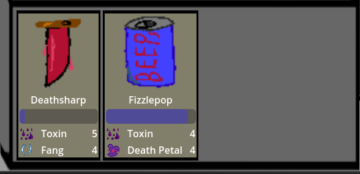
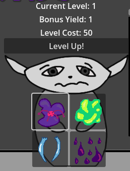
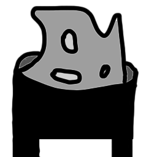
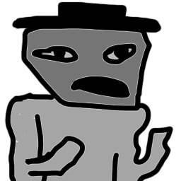
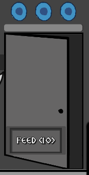
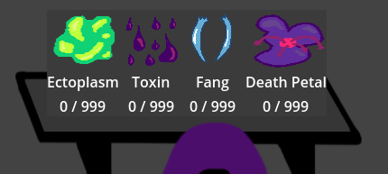

# *Feeding Closet-kun* Design Document

---

# Intro

## Game Summary Pitch

You are an alchemist making potions for your local community. They have problems, problems only alchemy is fit to solve.

Oh yeah, there's an eldritch horror in your closet that needs to be fed coalesced shadow. Or the world will end.

Good thing everyone pays you in coalesced shadow and your helpful servant Ron the Runner is here to help fetch ingredients for you!

## Inspiration

The main inspiration for this game is cooking games like Papa's Pizzeria and Overcooked, where the player has to complete orders within a certain amount of time in order to receive points. The title is inspired by isekai manga such as *Is It Wrong to Try to Pick Up Girls in a Dungeon?*, with their often very long and obvious titles.

## Player Experience

In a static shop environment, the player will fulfill potion orders from various people with ingredients in their shop. The player can command Ron the Runner to fetch them more ingredients after a short delay. Orders may expire, and grant coalesced shadow on completion, a resource used to stop the horror in Closet-kun from escaping.

A tutorial is available from the start screen to learn the controls and basic gameplay.

## Platform

The game is developed to release on internet browsers. Due to Godot 4.2.2 export bugs and issues with Chromium, the only supported browser is Firefox.

## Development Software / Tools

- Godot 4.2.2 for development.
- Aseprite for art assets.
- Adobe Photoshop for art assets.
- FL Studio for SFX and music.
- Visual Studio Code for text editing.

## Genre

Singeplayer, Shop Management

## Target Audience

With simple mechanics and a frantic pace, this game is marketed to semi-casual players who want a short, tense experience. Minor upgrades provide players with progression, while increased speeds over time ensure the challenge scales with them.

## A Note on Documentation

For 90% of this project's codebase, proper Godot 4 syntax was used for documentation comments. As such, scenes, classes, functions and variables should all have engine-generated documentation visible from within the Godot 4 editor.

Check out our codebase on Github and look through the Documentation in the Godot 4 editor!

For information about this process, check out this link: [Godot Comment Documentation](https://docs.godotengine.org/en/stable/tutorials/scripting/gdscript/gdscript_documentation_comments.html)

---

# Concept

## Gameplay Overview

The player fills potion orders using ingredients fetched by Ron the Runner. They can command Ron to get more ingredients so that they may fulfill these timed orders. The people requesting the orders pay in coalesced shadow, which is fed to Closet-kun to keep the horror inside it imprisoned. If the player fails to feed Closet-kun enough, the horror escapes and the game ends.

## Theme Interpretation

The player is tasked with mixing ingredients and creating potions, which fits the "Alchemy" theme. The player is paid with coalesced shadow, which is used to keep an unknowable horror locked away. The nature of the currency and vague threat of world-ending terror fits the "Shadow" theme.

## Primary Mechanics

**Ingredients** are the most basic unit of an **Order**. The player commands Ron the Runner to fetch **Ingredients**, which the player then uses to complete **Orders** for customers within their **Time Limit**. Upon successful order completion, the player receives **coalesced shadow** to feed to **Closet-kun** to reset the **Hunger Timer**.

The **Hunger Timer** constantly decays over time, and can only be partially reset by feeding it **coalesced shadow**. Once the **Hunger Timer** runs out, the **Hunger Stage** increases. Once the horror inside **Closet-kun** reaches its third **Hunger Stage**, it breaks free, and the game ends.

It is impossible to win the game. The player plays to find out how long they can last before the horror escapes.

## Secondary Mechanics

The player may feed **Closet-kun** 50 of any single **Ingredient** to reduce the **Hunger Stage** by one.

---

# Art

All mundane aspects of the background, such as Ron the Runner and the alchemy shop itself, are grayscale. The only elements of color in the game are magical objects, such as ingredients, orders, and the horror inside Closet-kun.

The assets themselves are intentionally sloppily-made, lending an almost Microsoft Paint-type style. Paint bucket is often used without touch-ups, and the lines are thick and erratic to give the game a slapped-together quality.

---

# Audio

## Music

The music is made using the Earthbound soundfont.

The main game track, "An Ode to Closet-kun", evokes lame mall music, but in a minor key to give the player a spookier feeling. The track that plays on a loss, "Their Tummy Rumbles", is meant to be a simple melancholic tune symbolizing that the alchemist's shop has been devoured by Closet-kun.

## Sound Effects

All sound effects were generated by Jacob Foxe using household items. Any speech sfx were generated using a pretty severe crusher in FL Studio. Generally, the goal was to create "feeling/vibe" noises, but a few quips were added for Ron the Runner and the Dudes.

In general, audio is where our team has the least experience, so it should be effective without being a timesink.

## Level Control

Owing to the inevitable sound imbalance, sliders are available once the game begins to decrease/increase master, music, and sfx volume.

---

# Game Experience

## UI

UI elements are part of the shop itself. The player drags ingredients from the shelf and clicks ingredients on Ron the Runner. The current total of coalesced shadow is displayed in the top right of the screen while the current time is displayed in the top left. The order queue is displayed on the shop counter, with progress bars showing how much time is left to fill them.

## Controls

The game exclusively uses the mouse and left click. Ingredients are dragged to orders with the mouse and left click, and the player clicks buttons to request ingredients and feed Closet-kun.

Right clicking on an order allows the user to cancel said order (this counts as an automatic fail of the order and incurs the 3 CS penalty).

Touch screen control has been preliminarily tested, though certain features (such as cancelling orders) cannot be performed.

## Progression

Progression is mainly achieved through upgrading the level of your Runner. Each subsequent level adds a bonus to every ingredient haul that they bring back, but the cost of upgrading increases as well!

## Gradual Difficulty Increase

Every 1 minute of gametime:

- Customer spawn frequency increases
- Customer stand time decreases (making way for another customer)

This ensures that the longer a player continues on, the more orders they'll have to deal with.

There is also a gradual increase to average order difficulty with each successive minute until minute 3 of gameplay (after which the average order difficulty remains constant). This ensures that players are not surprised with complex orders before they have their bearings and/or sufficient ingredients.

## Scores

Players' performance is tracked through an in-game timer in the top left of the screen. At the end of the game (when Closet-kun devours the alchemist's shop), this is tabulated as a score!

If the player hits "Play Again", this score is kept cached so that they may compete against themselves.

---

# Design

## Tools

### Order/Ingredient Creator

We created an Editor Plugin for Godot to expedite the creation of ingredients and orders. We called this "Seravat Manager," and it has a simple GUI to create these Resources and keep track of the "head" ID.

This can be seen at [SeravatManager](addons/resource_manager/)

## Data

A Resource-driven approach to data types was implemented in this project. This ensures that the data itself can communicate to containers and handlers without requiring more complex code.

This also reduces data overhead as it is not duplicated between instances and is instead accessed via reference.

Finally, this allowed us to bake functionality into the data types themselves.

For more information, see the Godot 4 documentation: [Resources - Godot 4](https://docs.godotengine.org/en/stable/tutorials/scripting/resources.html)

### Ingredients

The **Ingredient** class contains the following information:

- Name (String): Ingredient Name
- ID (int): Numerical ID
- imgRect (Filepath): Path to the ingredient texture

There are also modifier variables that can be changed from within the editor:

- orderTimeMod (float): Modifier for the amount of time to add to an order per 1 ingredient.
- orderCostMod (int): Modifier for the amount of CS to add to an order per 1 ingredient.
- fetchTimeMod (float): Modifier for the amount of time to add to a runner fetch mission per 1 ingredient.

### Fetching Ingredients

The **IngredientFetch** class is used by the [Runner](#runner) to determine fetch time/amounts for a given [Ingredient](#ingredients).

The **IngredientFetch** class contains the following information:

- ingredientData ([Ingredient](#ingredients)): Base Ingredient data.

There are also modifier variables that can be changed from within the editor:

- sourceTime (float): Time taken to gather the ingredient.
- gatherMin (int): Minimum amount gathered by the runner.
- gatherMax (int): Maximum amount gathered by the runner.
- timeMod (float): Adder to calculated time to fetch the ingredient.

### Ingredients in the Inventory

The **IngredientInventory** class is used by the [Inventory Storage](#inventory-ingredient-storage) system to keep track of the quantity of an [Ingredient](#ingredients). This is also the Resource used directly in Inventory UI elements.

It has the following *signals*:

- ingredient_updated

The **IngredientInventory** class contains the following information:

- ingredientData ([Ingredient](#ingredients)): Base Ingredient data.
- amountHeld (int): Amount of an ingredient in storage.

### Ingredients in an Order

The **IngredientOrder** class is used within [Orders](#orders) to keep track of the [Ingredients](#ingredients) needed to complete them.

It has the following *signals*:

- ingredient_updated

The **IngredientInventory** class contains the following information:

- ingredientData ([Ingredient](#ingredients)): Base Ingredient data.
- amountNeeded (int): Amount of an ingredient is needed in this order.
- completedFlag (bool): TRUE if the ingredient has been completed, FALSE otherwise.

### Orders

The **Order** class contains the following information:

- Name (String): Order (Potion) Name
- ID (int): Numerical ID
- imgRect (Filepath): Path to the ingredient texture
- neededIngredients (Array[[IngredientOrder](#ingredients-in-an-order)]): Array of ingredients w/ quantities in this order.
- difficulty (Enum - ORDER_DIFFICULTY): Difficulty (Simple, Intermediate, Complex) of the order.

### Full Orders

The **OrderFull** class contains complete order information and is used when generating the Order UI elements. They are handled by the [Order Manager](#order-manager) subsystem.  

It has the following *signals*:

- order_updated
- order_completed
- order_failed

The **OrderFull** class contains the following information:

- orderData ([Order](#orders)): Order data within this full order.

There are also modifier variables that can be changed from within the editor:

- timeAdder (float): Adder to the calculated order time.
- costAdder (int): Adder to the calculated order cost.

## Subsystems

### Shadometer

The **Shadometer** visually represents and manages the currency of the game, **Congealed Shadow**. It resides in the top-right corner of the screen and also displays changes to the CS quantity with popup numbers.

### Order Manager

The Order Manager handles creating, deploying, and destroying all orders.

#### Fetch Orders

At runtime, all order data is gathered from the filesystem to prepare arrays for the various order difficulty stages.

#### Deploying Orders

When a customer is spawned, an [Order](#orders) is fetched by the **Order Manager** and connected to said customer. This Order is also connected to a newly-created Order UI element, which is added to the on-screen queue.

The Order UI element changes color depending on the relative difficulty of its connected [Order](#orders).

#### Order Processing

Once an Order UI is in the on-screen queue, its timer begins and the user has until that timer runs out to satisfy all of its needed ingredients.

These UI elements check for the mouse entering its shape so that if a held [Ingredient](#ingredients) is dropped, the Order Manager knows where to add that quantity to.

#### Cancelling an Order / Failing an Order

When a timer runs out (OR an Order UI is right-clicked), the element drops out of the visual-queue, is erased, and 3 CS is deducted from the [Shadometer](#shadometer).

#### Succeeding an Order

If all ingredients are satisfied before an Order's timer elapses, the Order Manager queues a payout for said [Order](#orders), which is added to the [Shadometer](#shadometer).

### Runner

The runner fetches any of the four ingredients that the player desires. It has a button for each of the ingredients in addition to a Level Context overlay.

#### Fetching an Ingredient

When an ingredient button is pressed, a timer begins that is tracked on a progress bar. The amount returned is randomized based on the ingredient's "fetch range," and the fetch time is calculated (quantity * Ingredient_Fetch_Time).

Once the fetch timer elapses, the runner adds any bonus from its current level to the fetched quantity and then adds it to the shop's storage.

A "Cancel Fetch" button also appears which allows the player to abandon the current fetch mission and begin another.

#### Leveling up the Runner

The Runner starts at Level 0 and with each level gains that number in additional ingredient yield at the end of a fetch mission (this does not impact fetch time).

The first level-up requires 40 CS, then each subsequent level-up requires an additional 10CS (50CS for Level 2, etc.).

### Customers (Dude Manager)

  

Also known as "Dudes" in the source, these potion-needing individuals spawn regularly and request alchemical sustenance.

#### Dude Orders

Each **Dude** gets one order. On spawning, they enter the scene, add the order, and then leave.

#### Dude Audio

Dudes have a set of random audio tracks that they choose from and play when they spawn.

#### Spawn Rate

At runtime, a dude is spawned immediately. Thereafter, a random spawntime between 5-10s occurs for each dude.

At intervals of 60s, this spawntime is decreased by 0.5s (minimum of 1s for spawntime). This ensures the dudes gradually spawn more quickly (thus adding [Orders](#orders) more quickly).

### Closet-kun

The Closet Subsystem handles the gradual hunger increase of **Closet-kun** and ends the game if they starve.

#### Hunger Stages

The Closet has three **Hunger Stages** which are indicated by the three circles above the texture. Each time the [Hunger Timer](#hunger-timer) elapses, the **Hunger Stage** increases.

Hunger Stages can be decreased by dragging 50 of an [Ingredient](#ingredients) onto the **Closet** to feed **Closet-kun**.

#### Hunger Timer

The **Hunger Timer** begins at runtime and lasts for 30s. On timeout, it iterates the [Hunger Stage](#hunger-stages) and restarts (if [Game Over](#game-over) is not queued).

The **Hunger Timer** can be decreased. See [Feeding Closet-kun](#feeding-closet-kun).

#### Feeding Closet-kun

Closet-kun can be fed Congealed Shadow by pressing the **FEED (10)** button pictured above.

It requires a minimum of 10CS in the [Shadometer](#shadometer) to feed **Closet-kun**, and the [Hunger Timer](#hunger-timer) is restored 10% of the fullscale value per 10CS.

If the [Shadometer](#shadometer) contains more than 10CS, any amount will be consumed by **Closet-kun** up to the maximum Timer refresh.

#### Game Over

Once the final [Hunger Stage](#hunger-stages) elapses, a **Game Over** is queued.

### Inventory (Ingredient Storage)

The **Alchemist's** current Ingredient Storage is tracked here on-screen.

#### Gathering Ingredients

The [Runner](#runner) is used to gather more ingredients.

#### Using Ingredients

[Ingredients](#ingredients) are used by clicking and holding with the **Left Mouse Button** on one of the UI elements.

##### Filling Orders

Held [Ingredients](#ingredients) can be dropped onto [Orders](#orders) in the [Order Manager](#order-manager). If the [Order](#orders) needs any of this [Ingredient](#ingredients), the number will be subtracted and filled accordingly.

##### Reducing Closet-kun's Hunger Stage

50 of an [Ingredient](#ingredients) can be dropped onto **Closet-kun** to decrease a [Hunger Stage](#hunger-stages).

---

# Future

## Additional Subsystems

There are a few subsystems that we discussed during the quick development cycle of *Closet-kun*. Should we continue development in the future, we may implement some of the following.

### More Runners

One assistant is great, but two? Being able to source multiple resources at once and strategize Runner level-ups would expand gameplay beyond the fairly linear scope that it currently has.

### Dialogue

Originally, customers were going to have dialogue when they approached with some flavor text about why they need the alchemical brews. Though we wouldn't want to distract the player during the hectic gameplay, dialogue in some form would help us flesh out the world a bit.

### Unlockables

Deploying for Web, we're somewhat limited with what kind of user gameplay data we can save for the player. As such, trophies, achievements, and "shop expansions" were out of the question (not to mention they would've increased development time greatly). It would be cool to allow the player to deck out their shop a bit!

### Introduction Cutscene

In its current state, *Closet-kun* drops you right into the action, but we'd love to add a cinematic (or even just text wall) giving some more context into the world and the situation the player finds themself in.

### Leaderboards

Currently, scores are only compared to previous scores in the player's game session. This could be expanded by creating a leaderboard that the game posts scores to.

## Platform Deployment

Ideally, we would love to release *Closet-kun* on the following platforms:

- PC
- Mobile

As the Godot Engine was used, deployment to both of these platforms is fairly trivial.

---

# Development Timeline

- 2024-07-22 - 2024-07-23: Complete minimum viable product.
- 2024-07-24: Create rough assets for shop, potions, and dudes.
- 2024-07-25: Create and refine basic economy of the game. Time, ingredient costs, etc.
- 2024-07-26: Add sound effects and animations, clean up rough edges of art and implementation.
- 2024-07-27: Fix bugs and polish game balance.
- 2024-07-28: Continued polish. Tuning timing, orders, ingredients. Test/Fix deployment.
- 2024-07-29: Documentation Completion, final deployment, submission.

It's made for the [Pirate Jam 15](https://itch.io/jam/pirate)

Copyright Seravat Press 2024

