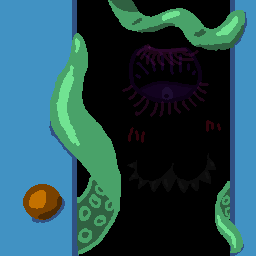

# *Feeding Closet-kun* Design Document

---

# Intro

## Game Summary Pitch

You are an alchemist making potions for your local community. They have problems, problems only alchemy is fit to solve.

Oh yeah, there's an eldritch horror in your closet that needs to be fed coalesced shadow. Or the world will end.

Good thing everyone pays you in coalesced shadow and your helpful servant Ron the Runner is here to help fetch ingredients for you!

## Inspiration

The main inspiration for this game is cooking games like Papa's Pizzeria and Overcooked, where the player has to complete orders within a certain amount of time in order to receive points. The title is inspired by isekai manga such as *Is It Wrong to Try to Pick Up Girls in a Dungeon?*, with their often very long and obvious titles.

## Player Experience

In a static shop environment, the player will fulfill potion orders from various people with ingredients in their shop. The player can command Ron the Runner to fetch them more ingredients after a short delay. Orders may expire, and grant coalesced shadow on completion, a resource used to stop the horror in Closet-kun from escaping.

A tutorial is available from the start screen to learn the controls and basic gameplay.

## Platform

The game is developed to release on internet browsers.

## Development Software / Tools

- Godot 4.2.2 for development.
- Aseprite for art assets.
- Adobe Photoshop for art assets.
- FL Studio for SFX and music.
- Visual Studio Code for text editing.

## Genre

Singeplayer, Shop Management

## Target Audience

With simple mechanics and a frantic pace, this game is marketed to semi-casual players who want a short, tense experience. Minor upgrades provide players with progression, while increased speeds over time ensure the challenge scales with them. 

---

# Concept

## Gameplay Overview

The player fills potion orders using ingredients fetched by Ron the Runner. They can command Ron to get more ingredients so that they may fulfill these timed orders. The people requesting the orders pay in coalesced shadow, which is fed to Closet-kun to keep the horror inside it imprisoned. If the player fails to feed Closet-kun enough, the horror escapes and the game ends.

## Theme Interpretation

The player is tasked with mixing ingredients and creating potions, which fits the "Alchemy" theme. The player is paid with coalesced shadow, which is used to keep an unknowable horror locked away. The nature of the currency and vague threat of world-ending terror fits the "Shadow" theme.

## Primary Mechanics

**Ingredients** are the most basic unit of an **Order**. The player commands Ron the Runner to fetch **Ingredients**, which the player then uses to complete **Orders** for customers within their **Time Limit**. Upon successful order completion, the player receives **coalesced shadow** to feed to **Closet-kun** to reset the **Hunger Timer**.

The **Hunger Timer** constantly decays over time, and can only be partially reset by feeding it **coalesced shadow**. Once the **Hunger Timer** runs out, the **Hunger Stage** increases. Once the horror inside **Closet-kun** reaches its third **Hunger Stage**, it breaks free, and the game ends.

It is impossible to win the game. The player plays to find out how long they can last before the horror escapes.

## Secondary Mechanics

The player may feed **Closet-kun** 50 of any single **Ingredient** to reduce the **Hunger Stage** by one.

---

# Art

All mundane aspects of the background, such as Ron the Runner and the alchemy shop itself, are grayscale. The only elements of color in the game are magical objects, such as ingredients, orders, and the horror inside Closet-kun.

The assets themselves are intentionally sloppily-made, lending an almost Microsoft Paint-type style. Paint bucket is often used without touch-ups, and the lines are thick and erratic to give the game a slapped-together quality.

---

# Audio

## Music

The music is made using the Earthbound soundfont.

The main game track, "An Ode to Closet-kun", evokes lame mall music, but in a minor key to give the player a spookier feeling. The track that plays on a loss, "Their Tummy Rumbles", is meant to be a simple melancholic tune symbolizing that the alchemist's shop has been devoured by Closet-kun.

## Sound Effects

All sound effects were generated by Jacob Foxe using household items. Any speech sfx were generated using a pretty severe crusher in FL Studio. Generally, the goal was to create "feeling/vibe" noises, but a few quips were added for Ron the Runner and the Dudes.

In general, audio is where our team has the least experience, so it should be effective without being a timesink. 

## Level Control

Owing to the inevitable sound imbalance, sliders are available once the game begins to decrease/increase master, music, and sfx volume. 

---

# Game Experience

## UI

UI elements are part of the shop itself. The player drags ingredients from the shelf and clicks ingredients on Ron the Runner. The current total of coalesced shadow is displayed in the top right of the screen while the current time is displayed in the top left. The order queue is displayed on the shop counter, with progress bars showing how much time is left to fill them.

## Controls

The game exclusively uses the mouse and left click. Ingredients are dragged to orders with the mouse and left click, and the player clicks buttons to request ingredients and feed Closet-kun.

## Progression

Progression is mainly achieved through upgrading the level of your Runner. Each subsequent level adds a bonus to every ingredient haul that they bring back, but the cost of upgrading increases as well!

## Gradual Difficulty Increase

Every 1 minute of gametime:
- Customer spawn frequency increases
- Customer stand time decreases (making way for another customer)

This ensures that the longer a player continues on, the more orders they'll have to deal with. 

## Scores

Players' performance is tracked through an in-game timer in the top left of the screen. At the end of the game (when Closet-kun devours the alchemist's shop), this is tabulated as a score! 

If the player hits "Play Again", this score is kept cached so that they may compete against themselves. 

---

# Future 

## Subsystems

There are a few subsystems that we discussed during the quick development cycle of *Closet-kun*. Should we continue development in the future, we may implement some of the following. 

### More Runners

One assistant is great, but two? Being able to source multiple resources at once and strategize Runner level-ups would expand gameplay beyond the fairly linear scope that it currently has. 

### Dialogue

Originally, customers were going to have dialogue when they approached with some flavor text about why they need the alchemical brews. Though we wouldn't want to distract the player during the hectic gameplay, dialogue in some form would help us flesh out the world a bit. 

### Unlockables

Deploying for Web, we're somewhat limited with what kind of user gameplay data we can save for the player. As such, trophies, achievements, and "shop expansions" were out of the question (not to mention they would've increased development time greatly). It would be cool to allow the player to deck out their shop a bit!

### Introduction Cutscene

In its current state, *Closet-kun* drops you right into the action, but we'd love to add a cinematic (or even just text wall) giving some more context into the world and the situation the player finds themself in. 

### Leaderboards

Currently, scores are only compared to previous scores in the player's game session. This could be expanded by creating a leaderboard that the game posts scores to. 

## Platform Deployment

Ideally, we would love to release *Closet-kun* on the following platforms:
- PC
- Mobile

As the Godot Engine was used, deployment both of these platforms is fairly trivial. 

---

# Development Timeline

- 2024-07-22 - 2024-07-23: Complete minimum viable product.
- 2024-07-24: Create rough assets for shop, potions, and dudes.
- 2024-07-25: Create and refine basic economy of the game. Time, ingredient costs, etc.
- 2024-07-26: Add sound effects and animations, clean up rough edges of art and implementation.
- 2024-07-27: Fix bugs and polish game balance.
- 2024-07-28: Continued polish. Tuning timing, orders, ingredients.

It's made for the [Pirate Jam 15](https://itch.io/jam/pirate)

Copyright Seravat Press 2024

